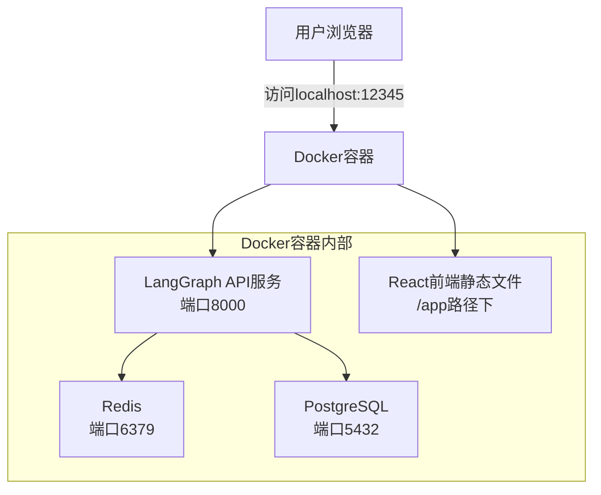
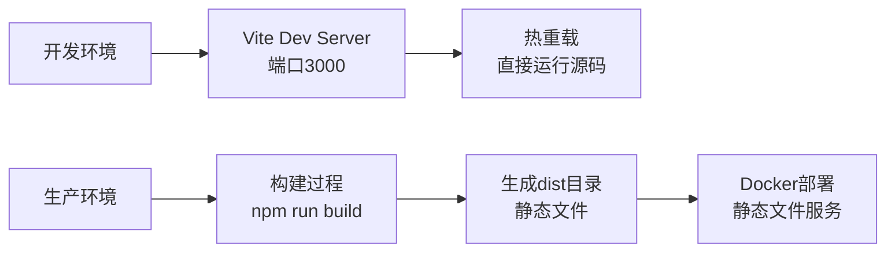

# 项目架构分析文档

## 概述

这是一个基于 LangGraph 的全栈 AI 应用项目，使用 Docker 进行容器化部署。项目采用前后端分离架构，前端使用 React + TypeScript，后端使用 LangGraph + FastAPI。

## 项目结构

```
gemini-fullstack-langgraph-quickstart/
├── frontend/                    # React 前端
│   ├── src/                    # 源代码
│   ├── public/                 # 静态资源
│   ├── dist/                   # 构建产物 (仅在构建后存在)
│   ├── package.json            # 前端依赖
│   └── vite.config.ts          # Vite 配置
├── backend/                     # Python 后端
│   ├── src/agent/              # 代理相关代码
│   │   ├── app.py             # 🎯 HTTP 应用入口点
│   │   ├── graph.py           # AI 工作流定义
│   │   └── agent.py           # 代理逻辑
│   ├── langgraph.json         # LangGraph 配置
│   └── pyproject.toml         # Python 依赖
├── docker-compose.yml          # Docker 编排配置
├── Dockerfile                  # 容器构建文件
└── README.md                   # 项目说明
```

## Docker 部署架构



### 服务组件说明

| 服务 | 端口映射 | 作用 |
|------|----------|------|
| `langgraph-api` | 12345:8000 | 主应用服务 |
| `langgraph-postgres` | 5433:5432 | 数据库存储 |
| `langgraph-redis` | 6379 | 缓存和消息队列 |

## app.py 文件的核心作用

`backend/src/agent/app.py` 是整个项目的**关键集成枢纽**，扮演以下重要角色：

### 1. LangGraph HTTP 应用入口

在 `langgraph.json` 中配置：
```json
{
  "http": {
    "app": "./src/agent/app.py:app"
  }
}
```

在 Docker 中设置：
```dockerfile
ENV LANGGRAPH_HTTP='{"app": "/deps/backend/src/agent/app.py:app"}'
```

### 2. 前后端一体化部署

```python
# 将前端挂载在 /app 路径下，避免与 LangGraph API 冲突
app.mount(
    "/app",
    create_frontend_router(),
    name="frontend",
)
```

### 3. 智能前端服务器

```python
def create_frontend_router(build_dir="../frontend/dist"):
    build_path = pathlib.Path(__file__).parent.parent.parent / build_dir
    
    if not build_path.is_dir() or not (build_path / "index.html").is_file():
        # 返回友好的错误提示
        return Route("/{path:path}", endpoint=dummy_frontend)
    
    # 返回静态文件服务器
    return StaticFiles(directory=build_path, html=True)
```

**特性**：
- ✅ **构建检测**：自动检测前端是否已构建
- ✅ **错误处理**：前端未构建时显示友好提示
- ✅ **路径解析**：自动处理相对路径到构建目录

### 4. 请求路由分发

| 路径 | 处理方式 | 说明 |
|------|----------|------|
| `/app/*` | `app.py` 处理 | 前端静态文件 |
| `/assistants/*` | LangGraph API | 助手管理 |
| `/threads/*` | LangGraph API | 会话管理 |
| `/runs/*` | LangGraph API | 运行管理 |
| `/docs` | LangGraph API | API文档 |

## 前端调用后端 API 机制

### 1. 环境配置

前端根据环境变量区分开发和生产模式：

```typescript
// frontend/src/App.tsx
apiUrl: import.meta.env.DEV
  ? "http://localhost:2024"      // 开发模式
  : "http://localhost:12345",    // 生产模式（Docker）
```

### 2. API 客户端

使用 `@langchain/langgraph-sdk` 进行流式 API 调用：

```typescript
const thread = useStream({
  apiUrl: import.meta.env.DEV
    ? "http://localhost:2024"
    : "http://localhost:12345",
  assistantId: "agent",
  messagesKey: "messages",
  // ...
});
```

### 3. 开发时代理配置

Vite 配置代理转发 API 请求：

```typescript
// frontend/vite.config.ts
server: {
  proxy: {
    "/api": {
      target: "http://127.0.0.1:8000",
      changeOrigin: true,
    },
  },
},
```

## 开发 vs 生产环境



### 开发环境
- **前端**：Vite 开发服务器 (localhost:3000)
- **后端**：LangGraph dev 服务器 (localhost:2024)
- **特点**：热重载、分离开发、快速迭代

### 生产环境（Docker）
- **统一入口**：localhost:12345
- **前端**：编译后的静态文件，由 app.py 服务
- **后端**：LangGraph API 服务
- **特点**：单容器部署、性能优化

## 关于 frontend/dist 目录

### 为什么没有 dist 目录？

1. **构建产物**：dist 目录在构建时生成，不应提交到代码仓库
2. **Git 忽略**：在 `frontend/.gitignore` 中被忽略
```
node_modules
dist          # ← 被 git 忽略
dist-ssr
*.local
```

3. **Docker 自动处理**：在容器构建过程中自动生成
```dockerfile
# Stage 1: Build React Frontend
RUN npm run build          # ← 生成 dist 目录

# Stage 2: 复制到最终容器
COPY --from=frontend-builder /app/frontend/dist /deps/frontend/dist
```

### 智能错误处理

当 dist 目录不存在时，app.py 会返回友好提示：
```
Frontend not built. Run 'npm run build' in the frontend directory.
```

## LangGraph API 端点

### 核心 API 端点

| 端点 | 方法 | 用途 |
|------|------|------|
| `/docs` | GET | 查看完整 API 文档 |
| `/assistants/search` | POST | 搜索助手 |
| `/threads` | POST | 创建新会话 |
| `/threads/{thread_id}/runs` | POST | 发送消息并运行 |
| `/threads/{thread_id}/runs/{run_id}` | GET | 查看运行状态 |
| `/threads/{thread_id}/runs/{run_id}/stream` | GET | 流式获取响应 |

### API 测试方法

#### 1. 查看 API 文档
```bash
curl http://localhost:12345/docs
```

#### 2. 使用 cURL 测试
```bash
# 查看助手列表
curl -X POST "http://localhost:12345/assistants/search" \
  -H "Content-Type: application/json" \
  -d '{"metadata": {}, "limit": 10, "offset": 0}'

# 创建会话
curl -X POST "http://localhost:12345/threads" \
  -H "Content-Type: application/json" \
  -d '{}'

# 发送消息
curl -X POST "http://localhost:12345/threads/{thread_id}/runs" \
  -H "Content-Type: application/json" \
  -d '{
    "assistant_id": "agent",
    "input": {
      "messages": [{"type": "human", "content": "Hello"}]
    }
  }'
```

#### 3. Python SDK 测试
```python
from langgraph_sdk import get_client

# 连接到 API
client = get_client(url="http://localhost:12345")

# 创建助手
assistant = await client.assistants.create(
    graph_id="agent",
    config={"configurable": {}},
)

# 创建会话并发送消息
thread = await client.threads.create()
run = await client.runs.create(
    thread["thread_id"],
    assistant["assistant_id"],
    input={"messages": [{"role": "human", "content": "Hello!"}]}
)
```

## 部署和运行指南

### 开发模式运行

```bash
# 终端 1：启动后端
cd backend
langgraph dev

# 终端 2：启动前端
cd frontend
npm install
npm run dev
```

### 生产模式部署

```bash
# 一键部署
docker-compose up -d

# 验证服务
curl http://localhost:12345/docs

# 访问前端
# 浏览器打开 http://localhost:12345/app
```

### 手动构建前端（可选）

```bash
cd frontend
npm install
npm run build
# 现在会生成 dist 目录
```

## 架构优势

1. **开发友好**：前后端分离，支持热重载
2. **部署简单**：单容器全栈部署
3. **可扩展性**：基于 FastAPI，易于扩展自定义功能
4. **容错性强**：智能错误处理和友好提示
5. **标准化**：遵循现代 Web 应用最佳实践

## 扩展建议

由于 app.py 是标准的 FastAPI 应用，可以轻松扩展：

```python
# 添加中间件
app.add_middleware(CORSMiddleware, ...)

# 添加自定义路由
@app.get("/health")
async def health_check():
    return {"status": "healthy"}

# 添加认证中间件
@app.middleware("http")
async def auth_middleware(request, call_next):
    # 自定义认证逻辑
    pass
```

---

**总结**：这是一个设计良好的全栈 AI 应用架构，app.py 作为核心枢纽，实现了前后端的完美集成和部署简化。 