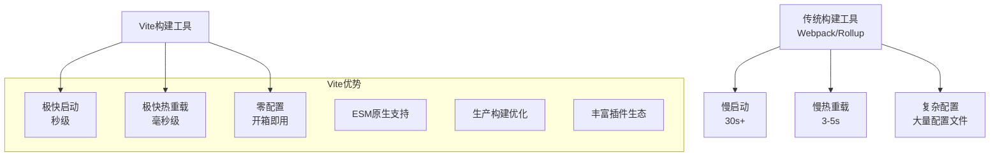
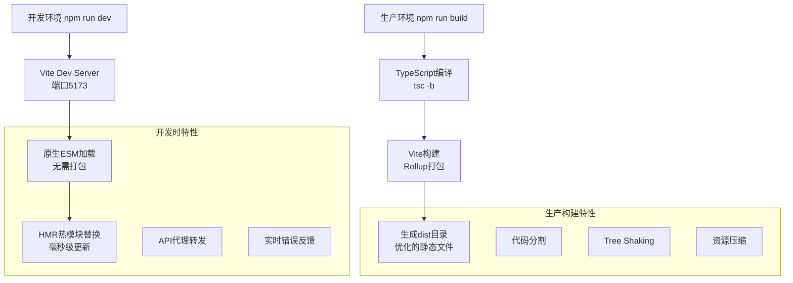
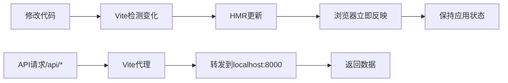

# Vite 构建工具详解

## 什么是 Vite？

**Vite**（法语中"快速"的意思，发音为 `/vit/`）是一个现代化的前端构建工具，由 Vue.js 的创建者尤雨溪开发。它是**下一代前端构建工具**，专为现代浏览器和开发体验而设计。

## Vite vs 传统构建工具对比

### 性能对比表

| 特性 | Webpack/Create React App | Vite |
|------|--------------------------|------|
| **启动速度** | 30-60秒 | 1-3秒 |
| **热重载** | 3-5秒 | 100-300毫秒 |
| **配置复杂度** | 复杂，需要大量配置 | 零配置，开箱即用 |
| **打包方式** | 开发时也打包 | 开发时原生ESM |
| **学习成本** | 高 | 低 |
| **生态系统** | 成熟但复杂 | 现代且简洁 |

### 工作流程对比



## Vite 的核心优势

### 1. **极快的冷启动**
```bash
# 传统工具需要先打包再启动
webpack -> bundle -> dev server (30s+)

# Vite 直接启动开发服务器
vite -> dev server (秒级)
```

**原理**：
- 传统工具在启动时需要先将所有模块打包
- Vite 利用浏览器原生 ESM，按需加载模块
- 只有访问到的页面才会被编译

### 2. **毫秒级热模块替换 (HMR)**
- **传统方式**：修改代码 → 重新打包 → 刷新页面 → 丢失应用状态
- **Vite 方式**：修改代码 → 直接替换模块 → 保持应用状态

### 3. **原生 ESM 支持**
```javascript
// 开发时，浏览器直接加载 ES 模块
import { useState } from 'react'
import './App.css'
// 无需预先打包，浏览器原生支持
```

### 4. **智能依赖预构建**
- 自动检测并预构建 npm 依赖
- 将 CommonJS 转换为 ESM
- 优化依赖加载性能

## 开发环境 vs 生产环境



### 开发环境特点
- **快速启动**：无需预打包，直接启动开发服务器
- **即时热重载**：代码修改后毫秒级生效
- **原生 ESM**：利用浏览器原生模块支持
- **API 代理**：轻松转发后端 API 请求

### 生产环境特点
- **Rollup 打包**：使用 Rollup 进行高效打包
- **代码分割**：自动进行代码分块
- **Tree Shaking**：移除未使用的代码
- **资源优化**：压缩 JS、CSS，优化图片

## 在本项目中的应用

### 1. **Vite 配置文件** (`frontend/vite.config.ts`)

```typescript
import path from "node:path";
import { defineConfig } from "vite";
import react from "@vitejs/plugin-react-swc";
import tailwindcss from "@tailwindcss/vite";

export default defineConfig({
  // 插件配置
  plugins: [
    react(),           // React 支持（使用 SWC 编译器）
    tailwindcss()      // TailwindCSS 支持
  ],
  
  // 基础路径（配合后端路由）
  base: "/app/",
  
  // 路径解析配置
  resolve: {
    alias: {
      "@": path.resolve(__dirname, "./src"),  // @ 指向 src 目录
    },
  },
  
  // 开发服务器配置
  server: {
    proxy: {
      // API 请求代理到后端
      "/api": {
        target: "http://127.0.0.1:8000",     
        changeOrigin: true,
      },
    },
  },
});
```

### 2. **项目脚本** (`frontend/package.json`)

```json
{
  "scripts": {
    "dev": "vite",                    // 启动开发服务器
    "build": "tsc -b && vite build", // 构建生产版本
    "lint": "eslint .",               // 代码检查
    "preview": "vite preview"         // 预览构建结果
  }
}
```

### 3. **依赖说明**

#### 核心依赖
```json
{
  "devDependencies": {
    "vite": "^6.3.4",                        // Vite 核心
    "@vitejs/plugin-react-swc": "^3.9.0",    // React 插件（SWC 编译器）
    "@tailwindcss/vite": "^4.1.5"            // TailwindCSS 插件
  }
}
```

## 关键特性详解

### 1. **插件系统**

```typescript
plugins: [
  react(),           // React JSX 转换和热重载
  tailwindcss()      // CSS 预处理和优化
]
```

**常用插件**：
- `@vitejs/plugin-react` - React 支持
- `@vitejs/plugin-vue` - Vue 支持
- `vite-plugin-eslint` - ESLint 集成
- `vite-plugin-mock` - API Mock

### 2. **路径别名**

```typescript
resolve: {
  alias: {
    "@": path.resolve(__dirname, "./src"),
    "@components": path.resolve(__dirname, "./src/components"),
    "@utils": path.resolve(__dirname, "./src/utils"),
  },
}
```

**使用示例**：
```javascript
// 使用别名
import { Button } from "@/components/ui/button"
import { formatDate } from "@/utils/date"

// 等同于
import { Button } from "./src/components/ui/button"
import { formatDate } from "./src/utils/date"
```

### 3. **API 代理配置**

```typescript
server: {
  proxy: {
    // 代理 /api 开头的请求
    "/api": {
      target: "http://127.0.0.1:8000",
      changeOrigin: true,
      // 可选：重写路径
      // rewrite: (path) => path.replace(/^\/api/, ''),
    },
    
    // 代理多个路径
    "/upload": {
      target: "http://127.0.0.1:3001",
      changeOrigin: true,
    }
  },
}
```

**实际效果**：
```javascript
// 前端请求
fetch('/api/users')
// 自动转发到
// http://127.0.0.1:8000/api/users
```

### 4. **环境变量**

```typescript
// 在代码中使用 Vite 环境变量
const isDev = import.meta.env.DEV        // 开发环境
const isProd = import.meta.env.PROD      // 生产环境
const mode = import.meta.env.MODE        // 当前模式
const baseUrl = import.meta.env.BASE_URL // 基础 URL

// 自定义环境变量 (需要 VITE_ 前缀)
const apiUrl = import.meta.env.VITE_API_URL
```

**环境变量文件**：
```bash
# .env.development
VITE_API_URL=http://localhost:8000
VITE_APP_TITLE=开发环境

# .env.production  
VITE_API_URL=https://api.example.com
VITE_APP_TITLE=生产环境
```

## 开发工作流

### 1. **启动开发服务器**

```bash
cd frontend
npm run dev

# 输出示例：
# ✨ Vite dev server running at:
# 🌐 Local:   http://localhost:5173/
# 🌐 Network: http://192.168.1.100:5173/
# 🔥 Hot Module Replacement enabled
# ready in 1205ms.
```

### 2. **开发流程**



### 3. **构建生产版本**

```bash
npm run build

# 输出示例：
# ✅ TypeScript compilation completed
# 📦 Building for production...
# ✨ Built in 2.34s
# 📁 Output directory: dist/
# 
# dist/
# ├── assets/
# │   ├── index-a1b2c3d4.js     # 主应用代码
# │   ├── vendor-e5f6g7h8.js    # 第三方库
# │   └── index-i9j0k1l2.css    # 样式文件
# └── index.html                # 入口页面
```

## 性能优化特性

### 1. **依赖预构建**
```javascript
// Vite 自动预构建 npm 依赖
// node_modules/.vite/deps/ 目录下缓存预构建结果
import React from 'react'        // 预构建
import lodash from 'lodash'      // 预构建
import './App.css'               // 动态加载
```

### 2. **代码分割**
```javascript
// 路由级别的代码分割
const HomePage = lazy(() => import('./pages/Home'))
const AboutPage = lazy(() => import('./pages/About'))
// 每个页面生成独立的 chunk
```

### 3. **Tree Shaking**
```javascript
// 只导入使用的部分
import { useState, useEffect } from 'react'  // ✅ 只导入需要的
import * as React from 'react'               // ❌ 导入整个库
```

## 常用命令和技巧

### 1. **开发命令**
```bash
# 启动开发服务器
npm run dev

# 指定端口
npm run dev -- --port 3000

# 启用 HTTPS
npm run dev -- --https

# 自动打开浏览器
npm run dev -- --open
```

### 2. **构建命令**
```bash
# 构建生产版本
npm run build

# 预览构建结果
npm run preview

# 分析构建产物
npm run build -- --mode analyze
```

### 3. **调试技巧**
```bash
# 显示详细日志
npm run dev -- --debug

# 显示性能信息
npm run dev -- --profile

# 强制重新预构建依赖
rm -rf node_modules/.vite && npm run dev
```

## 常见问题和解决方案

### 1. **依赖兼容性问题**
```javascript
// 某些库不支持 ESM，需要在配置中处理
export default defineConfig({
  optimizeDeps: {
    include: ['problematic-package'],
    exclude: ['other-package']
  }
})
```

### 2. **代理配置问题**
```javascript
// 复杂的代理配置
server: {
  proxy: {
    '/api': {
      target: 'http://localhost:8000',
      changeOrigin: true,
      configure: (proxy, options) => {
        proxy.on('error', (err, req, res) => {
          console.log('proxy error', err);
        });
      },
    },
  }
}
```

### 3. **环境变量问题**
```bash
# 确保环境变量以 VITE_ 开头
VITE_API_URL=http://localhost:8000  # ✅ 正确
API_URL=http://localhost:8000       # ❌ 无法访问
```

## 与其他工具集成

### 1. **TypeScript**
```typescript
// tsconfig.json 自动识别
{
  "compilerOptions": {
    "types": ["vite/client"]  // 添加 Vite 类型支持
  }
}
```

### 2. **ESLint**
```javascript
// vite.config.ts
import { defineConfig } from 'vite'
import eslint from 'vite-plugin-eslint'

export default defineConfig({
  plugins: [
    eslint({
      cache: false,
      include: ['src/**/*.ts', 'src/**/*.tsx']
    })
  ]
})
```

### 3. **测试工具**
```javascript
// Vitest (Vite 原生测试工具)
import { defineConfig } from 'vite'

export default defineConfig({
  test: {
    environment: 'jsdom',
    globals: true,
    setupFiles: './src/test/setup.ts'
  }
})
```

## 总结

### Vite 的核心价值

1. **极致性能**：
   - 🚀 秒级启动速度
   - ⚡ 毫秒级热重载
   - 📦 高效的生产构建

2. **开发体验**：
   - 🛠️ 零配置开箱即用
   - 🔧 简洁的配置文件
   - 🐛 清晰的错误提示

3. **现代化技术**：
   - 🌐 原生 ESM 支持
   - 📱 现代浏览器优化
   - 🔌 丰富的插件生态

4. **项目集成**：
   - ⚙️ 完美的 TypeScript 支持
   - 🎨 无缝的 CSS 预处理
   - 🔄 智能的 API 代理

### 在本项目中的作用

Vite 在这个 LangGraph 全栈项目中承担着**前端构建和开发服务器**的核心角色：

- **开发阶段**：提供极速的开发体验和实时热重载
- **构建阶段**：生成优化的静态文件供 Docker 部署
- **集成协调**：通过代理配置连接前后端，简化开发工作流

Vite 让前端开发变得更加高效和愉快，是现代前端项目不可或缺的构建工具！🚀 